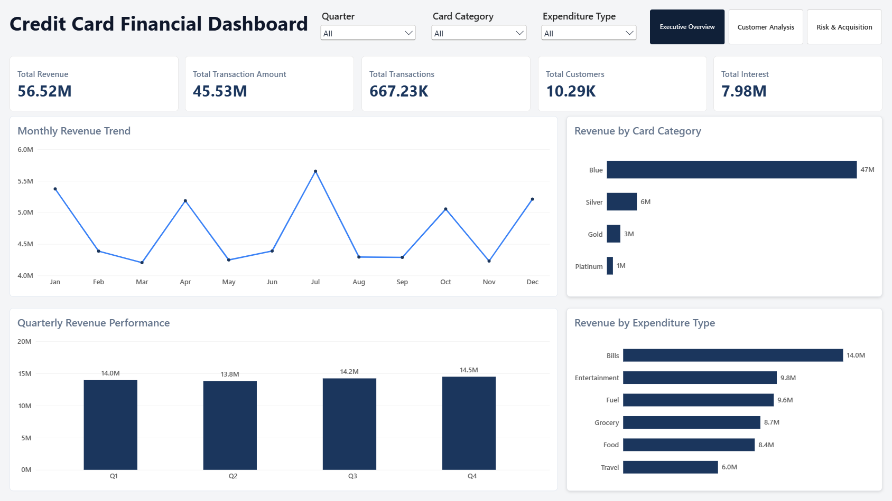
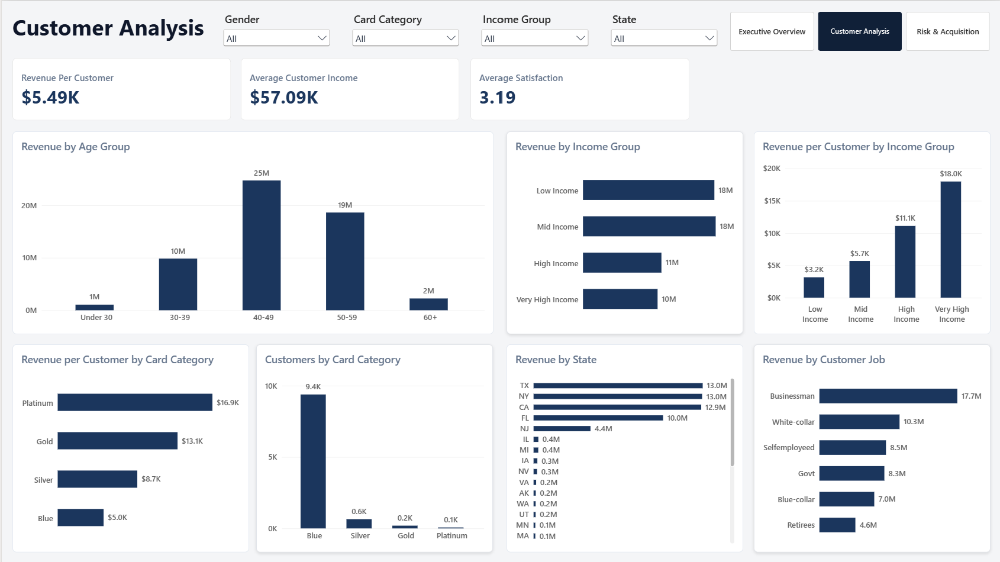
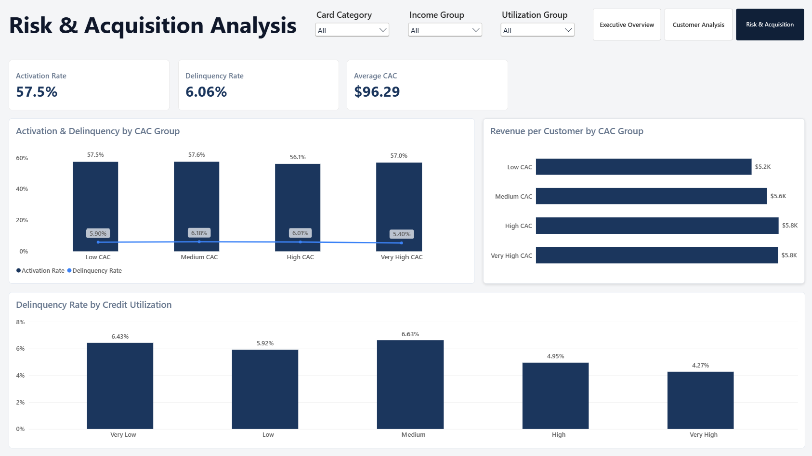

# Credit Card Financial Analytics

> **End-to-End Data Analytics Project | MySQL + SQL + Power BI + DAX**

An end-to-end financial analytics project that analyzes credit card revenue, customer segments, transaction behavior, customer acquisition cost, activation, and credit risk using MySQL, SQL, Power BI, and DAX.

---

## 📊 Dashboard Preview

### Executive Overview



### Customer Analysis



### Risk & Acquisition



---

## 🎯 Business Objective

The objective of this project is to transform raw credit card customer and transaction data into meaningful business insights.

The analysis focuses on:

- Revenue performance
- Transaction activity
- Card category performance
- Customer segmentation
- Geographic performance
- Customer acquisition cost
- Card activation
- Credit utilization
- Delinquency
- Monthly and quarterly revenue trends

---

## 🛠️ Technology Stack

| Technology | Purpose |
|------------|---------|
| MySQL | Database creation, data loading and validation |
| SQL | KPI calculations and business analysis |
| Power BI | Interactive dashboard development |
| DAX | Measures and customer segmentation |
| VS Code | SQL development and documentation |
| Git & GitHub | Version control and portfolio publishing |

---

## 📂 Dataset

The project uses four CSV files containing credit card and customer information.

## 📊 Dataset

The project structure and dashboard concept were inspired by the original Credit Card Financial Dashboard project by Rishabh Mishra.

> **Data note:** The original dataset is not included in this public repository. The CSV files used during development are retained locally and excluded from GitHub.

Original project reference:
https://github.com/rishabhnmishra/Credit_Card_Financial_Dashboard

### Credit Card Data

- `credit_card.csv`
- `cc_add.csv`

### Customer Data

- `customer.csv`
- `cust_add.csv`

The data was loaded into MySQL using two tables:

- `cc_detail`
- `cust_detail`

The final loaded dataset contains **10,293 records**.

---

## 🔄 Project Workflow

```text
Raw CSV Data
      ↓
MySQL Database
      ↓
Data Loading & Cleaning
      ↓
Data Validation
      ↓
SQL Business Analysis
      ↓
Power BI Data Model
      ↓
DAX Measures & Segmentation
      ↓
Interactive Dashboard
      ↓
Business Insights
```

---

# 📈 Key Performance Indicators

Based on the complete loaded dataset:

| KPI | Result |
|---|---:|
| **Total Revenue** | **$56.52M** |
| **Transaction Amount** | **$45.53M** |
| **Total Transactions** | **667K** |
| **Interest Earned** | **$7.98M** |
| **Revenue per Customer** | **$5.49K** |
| **Activation Rate** | **57.46%** |
| **Delinquency Rate** | **6.06%** |
| **Average CAC** | **$96.29** |
| **Average Utilization** | **27.45%** |

### Revenue Calculation

Total Revenue is calculated as:

```text
Annual Fees
+ Transaction Amount
+ Interest Earned
= Total Revenue
```

---

# 🔎 Key Business Insights

## 💳 1. Card Category Performance

Blue cards generate the highest total revenue:

**$47.19M**

Platinum cards generate the highest revenue per customer:

**$16.95K/customer**

| Card Category | Revenue | Revenue / Customer |
|---|---:|---:|
| Blue | $47.19M | $5.03K |
| Silver | $5.66M | $8.72K |
| Gold | $2.53M | $13.13K |
| Platinum | $1.14M | $16.95K |

### Insight

Blue cards generate the majority of overall revenue because of their significantly larger customer volume.

Premium card categories generate substantially higher revenue per customer, although their customer volumes are much smaller.

---

## 👥 2. Customer Income Analysis

Revenue per customer increases substantially across income groups.

| Income Group | Revenue / Customer |
|---|---:|
| Low Income | $3.17K |
| Mid Income | $5.70K |
| High Income | $11.12K |
| Very High Income | $17.99K |

### Insight

Higher-income customer segments generate significantly more revenue per customer than lower-income segments.

---

## 🗺️ 3. Geographic Performance

The highest-revenue states are:

1. Texas
2. New York
3. California
4. Florida
5. New Jersey

Texas, New York and California together contribute approximately:

**68.81% of total revenue**

### Insight

Revenue is concentrated in a small number of states, with TX, NY and CA accounting for the largest share of overall revenue.

---

## 🛒 4. Expenditure Analysis

Bills generate the highest total revenue:

**$14.00M**

Travel has the highest average transaction value:

**$100.51**

| Expenditure Type | Revenue | Avg. Transaction Value |
|---|---:|---:|
| Bills | $14.00M | $62.72 |
| Entertainment | $9.78M | $61.30 |
| Fuel | $9.59M | $65.52 |
| Grocery | $8.73M | $67.28 |
| Food | $8.38M | $75.86 |
| Travel | $6.04M | $100.51 |

### Insight

Bills generates the highest revenue through transaction volume, while Travel has the highest average transaction value.

---

## 📅 5. Monthly Revenue Performance

| Month | Revenue |
|---|---:|
| January | $5.37M |
| February | $4.39M |
| March | $4.20M |
| April | $5.19M |
| May | $4.25M |
| June | $4.39M |
| July | $5.65M |
| August | $4.29M |
| September | $4.29M |
| October | $5.05M |
| November | $4.23M |
| December | $5.21M |

### Insight

- **July** records the highest monthly revenue at **$5.65M**.
- **March** records the lowest monthly revenue at **$4.20M**.
- **Q4** records the highest quarterly revenue.

> The dataset covers one year, so these monthly differences should not be interpreted as long-term seasonality.

---

## 📊 6. Quarterly Performance

| Quarter | Revenue |
|---|---:|
| Q1 | $13.96M |
| Q2 | $13.82M |
| Q3 | $14.24M |
| Q4 | $14.50M |

### Insight

**Q4** records the highest quarterly revenue, while **Q2** records the lowest.

---

## 💸 7. Customer Acquisition Cost Analysis

Revenue per customer increases across the CAC groups.

| CAC Group | Revenue / Customer |
|---|---:|
| Low CAC | $5.19K |
| Medium CAC | $5.55K |
| High CAC | $5.75K |
| Very High CAC | $5.91K |

### Insight

Customers in higher CAC groups generate higher revenue per customer in this dataset.

However, this relationship does **not** establish that higher acquisition spending causes higher customer value.

A complete acquisition analysis should evaluate:

```text
CAC
 ↓
Customer Revenue
 ↓
Customer Lifetime Value
 ↓
Profitability
```

---

## ⚠️ 8. Credit Risk Analysis

The overall delinquency rate is:

**6.06%**

Average credit utilization is:

**27.45%**

The analysis does not show a consistent positive relationship between credit utilization and delinquency.

### Insight

Credit utilization alone does not appear to explain delinquency patterns in this dataset.

Therefore, utilization should be considered together with other customer and credit characteristics when evaluating risk.

---

## 👨‍💼 9. Customer Job Analysis

Revenue by customer job shows the following ranking:

1. Businessman
2. White-collar
3. Selfemployeed
4. Govt
5. Blue-collar
6. Retirees

Businessman customers generate approximately:

**$17.70M revenue**

### Insight

Businessman customers generate the highest total revenue among the job categories in the dataset.

---

## 🚻 10. Gender Analysis

| Gender | Revenue | Revenue / Customer |
|---|---:|---:|
| Male | $30.93M | $7.18K |
| Female | $25.59M | $4.27K |

### Insight

Male customers contribute higher total revenue and higher revenue per customer in this dataset.

---

## 💳 11. Transaction Channel Analysis

Transactions are distributed across three channels:

| Channel | Customers | Transactions | Avg. Transaction |
|---|---:|---:|---:|
| Swipe | 7,232 | 446,607 | $63.86 |
| Chip | 2,457 | 180,759 | $78.37 |
| Online | 604 | 39,868 | $71.41 |

### Insight

Swipe is the dominant transaction channel by customer and transaction volume.

Chip transactions have the highest average transaction value.

---

# 📊 Dashboard Pages

## 01 — Executive Overview

Provides a high-level view of financial performance.

### KPIs

- Total Revenue
- Transaction Amount
- Total Transactions
- Interest Earned
- Revenue per Customer

### Visuals

- Quarterly Revenue Performance
- Monthly Revenue Trend
- Revenue by Card Category
- Revenue by Expenditure Type

### Filters

- Card Category
- Quarter
- Expenditure Type

---

## 02 — Customer Analysis

Focuses on customer segmentation and revenue contribution.

### KPIs

- Revenue per Customer
- Average Customer Income
- Average Satisfaction

### Visuals

- Revenue per Customer by Card Category
- Revenue by Customer Job
- Revenue per Customer by Income Group
- Revenue by Age Group
- Customers by Card Category
- Revenue by Income Group
- Revenue by State

### Filters

- Gender
- Card Category
- Income Group
- State

---

## 03 — Risk & Acquisition

Focuses on acquisition efficiency and credit risk.

### KPIs

- Activation Rate
- Delinquency Rate
- Average CAC

### Visuals

- Revenue per Customer by CAC Group
- Delinquency Rate by Credit Utilization
- Activation & Delinquency by CAC Group

### Filters

- Card Category
- Income Group
- Utilization Group

---

# 🧮 SQL Analysis

MySQL was used for data loading, validation and business analysis.

### SQL Analysis Includes

- Overall financial KPIs
- Revenue by card category
- Revenue by gender
- Revenue by expenditure type
- Revenue by state
- Revenue by customer job
- Revenue by income group
- Revenue by age group
- Monthly revenue trends
- Quarterly revenue trends
- CAC analysis
- Activation analysis
- Delinquency analysis
- Credit utilization analysis
- Transaction channel analysis

### SQL Scripts

```text
sql/
├── database_setup.sql
└── analysis.sql
```

---

# 🧠 Power BI & DAX

Power BI was used to build the interactive dashboard.

Dedicated DAX measures were created for the main KPIs.

### Revenue per Customer

```DAX
Revenue Per Customer =
DIVIDE(
    [Total Revenue],
    [Total Customers]
)
```

### Activation Rate

```DAX
Activation Rate =
DIVIDE(
    SUM(cc_detail[Activation_30_Days]),
    COUNTROWS(cc_detail)
)
```

### Delinquency Rate

```DAX
Delinquency Rate =
DIVIDE(
    SUM(cc_detail[Delinquent_Acc]),
    COUNTROWS(cc_detail)
)
```

### Average CAC

```DAX
Average CAC =
AVERAGE(cc_detail[Customer_Acq_Cost])
```

---

# 👥 Customer Segmentation

The Power BI model includes calculated customer segments.

### Income Groups

- Low Income
- Mid Income
- High Income
- Very High Income

### Age Groups

- Under 30
- 30–39
- 40–49
- 50–59
- 60+

### CAC Groups

- Low CAC
- Medium CAC
- High CAC
- Very High CAC

### Utilization Groups

- Very Low
- Low
- Medium
- High
- Very High

---

# 💡 Business Recommendations

## 1. Focus on High-Value Customer Segments

Higher-income customers and premium-card customers generate substantially higher revenue per customer.

These segments can be considered for targeted retention and engagement strategies.

## 2. Prioritize Major Revenue Markets

TX, NY and CA contribute approximately 69% of total revenue.

These markets represent important areas for customer retention and targeted business initiatives.

## 3. Improve Lower-Value Customer Engagement

Lower-income segments generate lower revenue per customer.

Targeted rewards, cross-selling and engagement strategies could be evaluated to increase customer value.

## 4. Evaluate CAC Alongside Customer Value

Higher CAC groups show higher revenue per customer, but CAC should not be evaluated independently.

A stronger business analysis should include:

```text
CAC
+
Revenue
+
Customer Lifetime Value
+
Profitability
```

## 5. Monitor Credit Risk

Delinquency should be monitored across:

- Income
- Card Category
- Credit Utilization
- CAC
- Customer Segments

---

# ⚠️ Analytical Limitations

- The dataset represents one year of activity.
- Monthly patterns cannot establish long-term seasonality.
- Observed relationships do not establish causation.
- Some premium-card segments have relatively small sample sizes.
- Customer profitability cannot be calculated without additional cost information.
- Customer Lifetime Value cannot be calculated without historical customer-level retention data.
- Delinquency analysis is descriptive and does not represent a predictive credit-risk model.

---

# 🚀 Future Enhancements

Potential extensions include:

- Customer Lifetime Value analysis
- Customer churn analysis
- Customer retention analysis
- Cohort analysis
- Customer profitability analysis
- Predictive delinquency modeling
- Churn prediction
- Acquisition ROI analysis
- Customer clustering
- Year-over-year analysis
- Automated Power BI refresh

---

# 📂 Repository Structure

```text
Credit-Card-Financial-Analytics/
│
├── README.md
│
├── data/
│   ├── credit_card.csv
│   ├── cc_add.csv
│   ├── customer.csv
│   └── cust_add.csv
│
├── sql/
│   ├── database_setup.sql
│   └── analysis.sql
│
├── powerbi/
│   └── Credit_Card_Analysis.pbix
│
└── screenshots/
    ├── executive_overview.png
    ├── customer_analysis.png
    └── risk_acquisition.png
```

> **Data note:** Before publishing the CSV files to a public GitHub repository, verify that the original dataset license permits redistribution.

---

# ▶️ How to Run the Project

## 1. Clone the Repository

```bash
git clone https://github.com/YOUR_USERNAME/credit-card-financial-analytics.git
cd credit-card-financial-analytics
```

## 2. Set Up MySQL

Run:

```text
sql/database_setup.sql
```

This creates the `credit_card_analytics` database and required tables.

## 3. Load the CSV Data

Check your MySQL `secure_file_priv` directory:

```sql
SHOW VARIABLES LIKE 'secure_file_priv';
```

Place the CSV files in the returned directory.

Update the file paths in:

```text
sql/database_setup.sql
```

if required.

## 4. Run SQL Analysis

Execute:

```text
sql/analysis.sql
```

This reproduces the main business analysis and KPI calculations.

## 5. Open Power BI

Open:

```text
powerbi/Credit_Card_Analysis.pbix
```

The report contains three pages:

- Executive Overview
- Customer Analysis
- Risk & Acquisition

---

# 🎯 Skills Demonstrated

### Data Analytics

`Data Cleaning` · `Data Validation` · `Exploratory Data Analysis` · `Customer Segmentation` · `Financial Analysis` · `Risk Analysis`

### SQL

`MySQL` · `Joins` · `Aggregations` · `CASE` · `Date Functions` · `Data Validation` · `Business KPIs`

### Power BI

`Data Modeling` · `DAX` · `KPI Cards` · `Slicers` · `Interactive Dashboards` · `Page Navigation` · `Data Visualization`

---

# 📌 Project Highlights

- End-to-end analytics workflow
- MySQL database implementation
- SQL-based financial analysis
- Power BI interactive dashboard
- DAX measures
- Customer segmentation
- Revenue analysis
- Customer acquisition analysis
- Credit risk analysis
- Geographic analysis
- Transaction analysis
- Business recommendations

---

# 👨‍💻 Author

**Saurav Kumar**

**Data Analyst**

**Skills:** SQL · MySQL · Power BI · Excel · Python

---

## ⭐ Project Summary

This project demonstrates an end-to-end data analytics workflow:

```text
Raw Data
   ↓
MySQL
   ↓
SQL Analysis
   ↓
Power BI
   ↓
DAX
   ↓
Interactive Dashboard
   ↓
Business Insights
```

The project demonstrates how raw financial and customer data can be transformed into actionable insights for **revenue analysis, customer segmentation, acquisition evaluation, and credit-risk monitoring**.